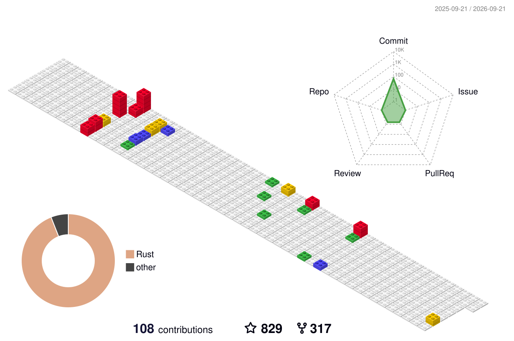

## Hey 👋, I'm JefferyWang!  
  

  
  

   

## Languages and Tools

  

   

## Github Stats  

   

  

   

  
  

   

            
            

 

----

Generated using <a href="https://profilinator.rishav.dev/" target="_blank">Github Profilinator</a>

